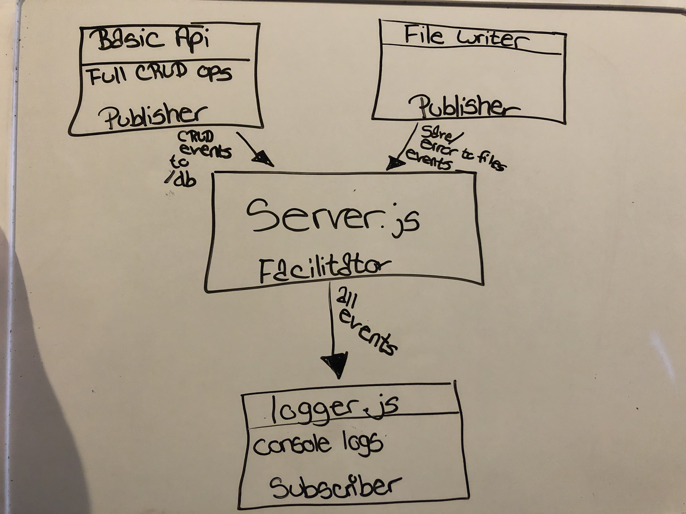

# LAB - 19

## Project Name
Message Queue Server and Logger

### Author: Tia Rose

### Links and Resources
* [submission PR](https://github.com/tia-rose-401-advanced-javascript/Lab-19-Message-Queue/pull/1)
* [travis](https://www.travis-ci.com/tia-rose-401-advanced-javascript/Lab-19-Message-Queue)

### Modules
#### `server.js`
##### Read file, alter content, write altered content back in the file

###### `readFilefileName) -> file data`
Read the contents of a file and return it

###### `writeFile(fileName, text) -> file data`
Take the data and write it back to the appropriate file

###### `upper(text) -> text`
Take the text and turn it to all caps

### Setup
#### `.env` requirements
* Q_SERVER

#### Running the app
* `npm start` or node server.js ./files/test.txt
  
#### Tests
* How do you run tests?

npm run test

* What assertions were made?
* What assertions need to be / should be made?

#### UML
